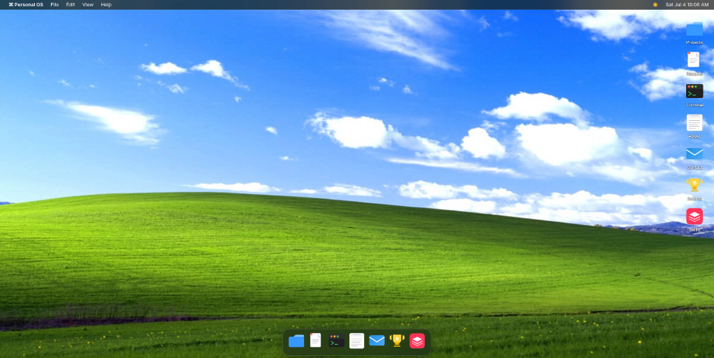
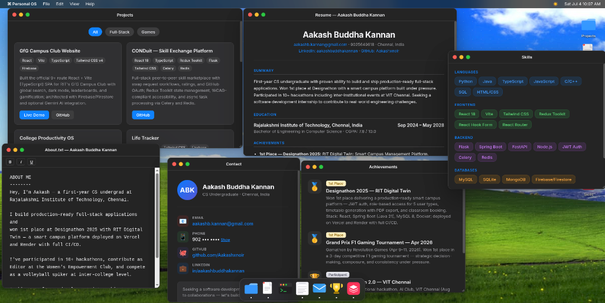
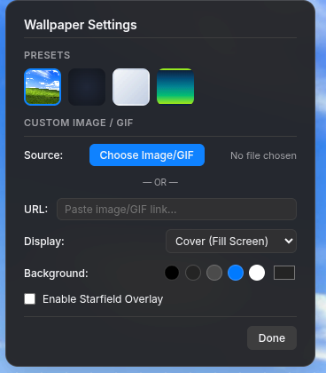
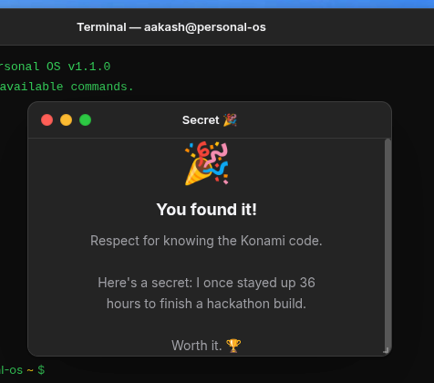

# ⌘ Personal OS — macOS-Style Developer Portfolio

A responsive, interactive, and beautifully designed developer portfolio styled after the macOS desktop environment. Users can interact with windows, run terminal commands, customize their experience with wallpapers, and explore projects, skills, and awards in an immersive OS-like interface.

## 📸 Screenshots & Visual Tour

### 1. Desktop Workspace

*The main desktop workspace running the classic **Windows XP Bliss** wallpaper preset. It includes desktop icons on the right, a system menubar at the top, and the interactive app dock at the bottom.*

---

### 2. Multi-Window Multitasking

*All portfolio applications (Projects, Resume, Skills, About, Achievements, and Contact) open simultaneously. The windows are draggable, resizable, and support focus stacking (Z-index layering).*

---

### 3. Advanced Wallpaper & Background Configurations

*The wallpaper preference panel. Users can choose from presets, paste image/GIF URLs, or upload local image files. For transparent images or GIFs, they can configure the scale layout and custom solid background colors directly beneath it, as well as toggle a CSS starfield canvas.*

---

### 4. Interactive Easter Eggs

*The hidden "Secret" window, unlocked dynamically by typing the classic **Konami Code** (`↑` `↑` `↓` `↓` `←` `→` `←` `→` `b` `a`) anywhere on the desktop.*

---

## ✨ Key Features

- **Draggable & Resizable Windows**: A custom window manager built with pure JavaScript allowing users to move, resize, minimize, maximize, and focus different windows.
- **Mac-Style Dock**: An interactive dock at the bottom of the screen featuring magnification hover effects.
- **Interactive Terminal**: A fully functional custom terminal emulator supporting system command mocks like `help`, `skills`, `whoami`, `projects`, `clear`, and `neofetch`.
- **Advanced Wallpaper Settings**:
  - Predefined aesthetic presets (like the classic **Windows XP Bliss** wallpaper, Aurora, Sunset Glow, and a CSS Starfield background).
  - Custom file upload support (drag & drop or choose local images and GIFs).
  - External URL loader for image/GIF backgrounds.
  - Sizing constraints (`Cover`, `Contain`, `Center`, `Tile`).
  - Solid background colors & presets to layer underneath transparent GIFs.
  - Interactive CSS starfield overlay toggle.
- **Global Themes**: Dynamic dark mode and light mode toggles that automatically update window styles, menu items, and background themes.
- **Mobile Responsive**: Fallback tailored mobile interface for smaller screens.

## 🛠️ Technology Stack

- **Structure**: HTML5 Semantic elements
- **Styling**: Modern Vanilla CSS (variables, glassmorphism filters, grid layouts, responsive breakpoints)
- **Interactions**: Pure Vanilla JavaScript (event-delegation, LocalStorage synchronization, FileReader API)
- **Local Dev Server**: Python HTTP Server

## 🚀 Getting Started

To run the project locally:

1. **Clone the repository:**
   ```bash
   git clone https://github.com/Aakashxnoir/mac-styled-portfilio-.git
   cd mac-styled-portfilio-
   ```

2. **Install dependencies (optional):**
   No external packages or dependencies are required. A simple local HTTP server is used.

3. **Start the local server:**
   ```bash
   npm run dev
   # OR
   python -m http.server 8080
   ```

4. **Open in browser:**
   Navigate to [http://localhost:8080/](http://localhost:8080/) or [http://localhost:8080/Os.html](http://localhost:8080/Os.html) to view the application.

## 📁 Project Structure

- `index.html` — Main layout, style declarations, content modules, and OS logic.
- `Os.html` — Symbolic link pointing to `index.html` for direct entry point support.
- `assets/` — Directory containing screenshot previews and assets.
- `package.json` — Dev script execution configuration.
- `.gitignore` — Ignore metadata and cache files.
- `README.md` — Project documentation.
